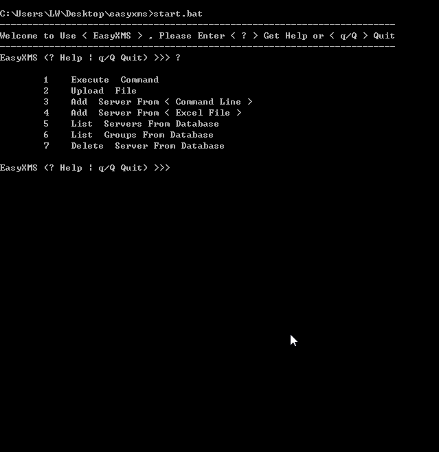
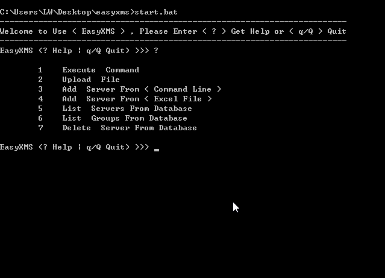
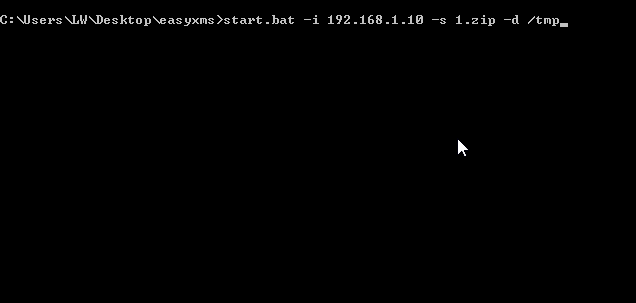
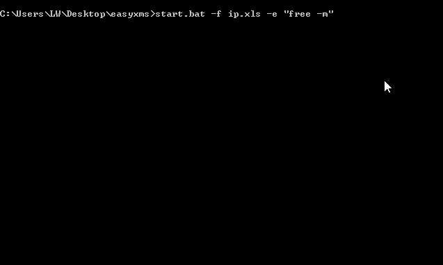
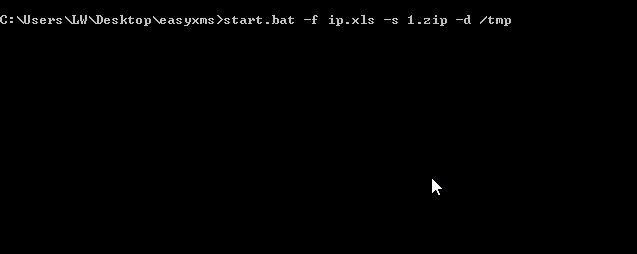
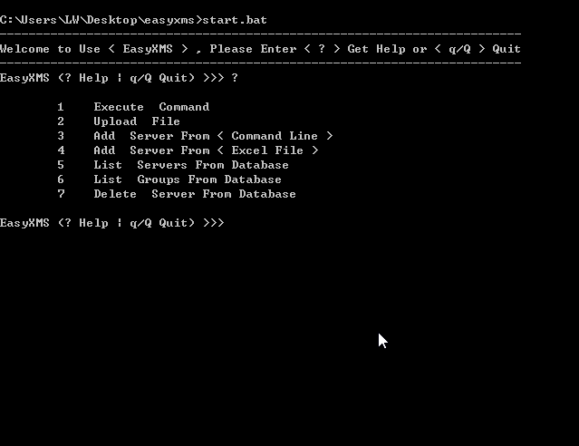
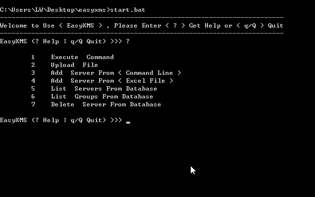
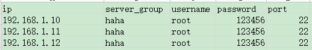
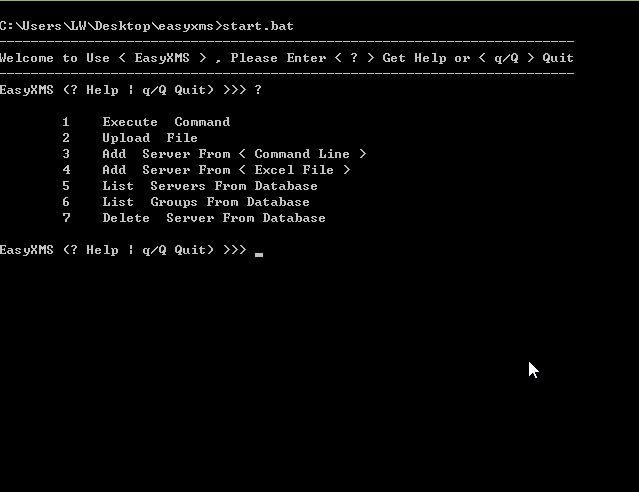
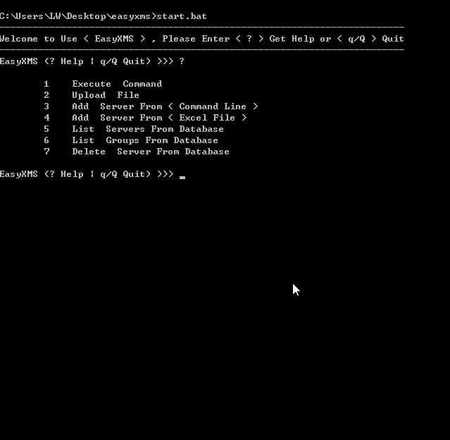

EasyXMS
-------

 EasyXMS是一个Java编写的用于批量管理Linux服务器的简易系统，如：多线程批量执行命令、多线程批量上传文件等功能.
 
 2种使用模式:
 
 
        1.交互模式执行动作
        2.直接在命令行执行动作

一、运行环境
-------

        JDK1.6+

二、注意事项
-------

        1.在sshd配置文件/etc/ssh/sshd_config中 UseDNS yes 修改为 UseDNS no,可以确保连接顺畅
        2.像执行时间过长的命令,如top、yum这类命令不适合执行
        3.进入到项目的目录,使用Ant来编译打包

三、交互模式执行动作效果演示
--------------------

### 1.主菜单

### 2.批量执行命令

### 3.批量上传文件

四、命令行执行动作效果演示
--------------------

演示在window系统上演示

### 1.批量执行命令

IP地址、分组、用户名、密码和端口事先添加到程序的数据库中

### 2.批量上传文件

IP地址、分组、用户名、密码和端口事先添加到程序的数据库中

### 3.直接读取Excel文件的信息批量执行命令

Excel文件中包含IP地址、分组、用户名、密码和端口

### 4.直接读取Excel文件的信息批量上传文件

Excel文件中包含IP地址、分组、用户名、密码和端口

五、添加删除IP信息效果演示
-----------------------

### 1.添加IP信息

IP地址、分组、用户名、密码和端口，添加到程序的数据库中

从命令行添加

从Excel文件中添加

Excel文件的模板

### 2.删除IP信息

### 3.列出IP信息

